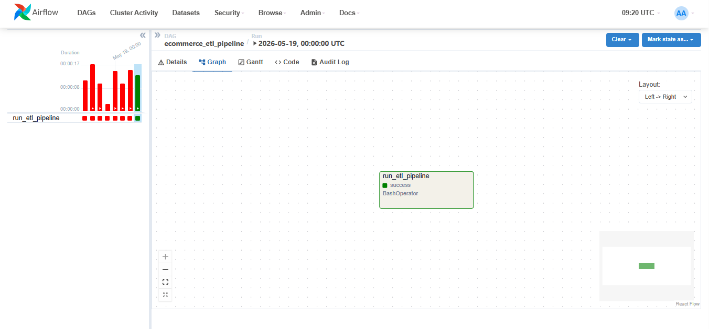
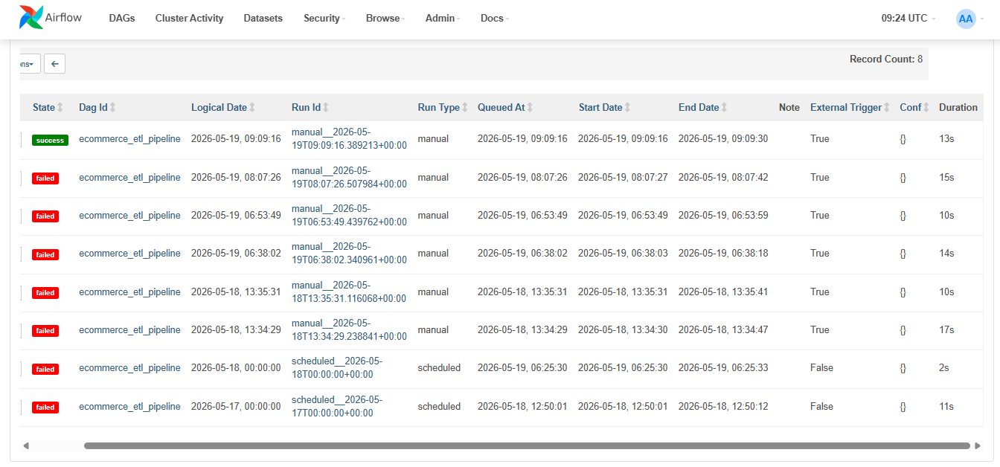
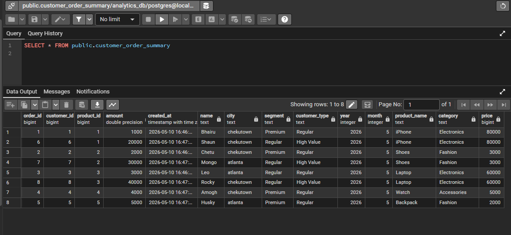
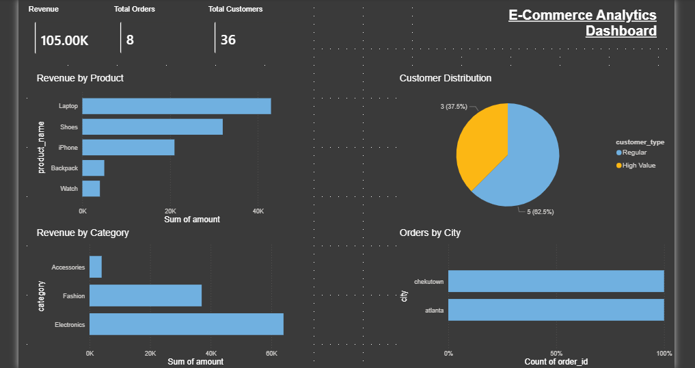

# Dockerized E-Commerce Data Pipeline
This project demonstrates a multi-source ETL pipeline integrating PostgreSQL, MongoDB, and CSV data sources using Python and Pandas. The workflow is orchestrated using Apache Airflow and containerized using Docker.

A multi-source ETL pipeline built using:

- Django
- PostgreSQL
- MongoDB
- Pandas
- SQLAlchemy

## Tech Stack

- Python
- Django
- PostgreSQL
- MongoDB
- Pandas
- Apache Airflow
- Docker

## Features

- Multi-source ETL pipeline
- PostgreSQL + MongoDB integration
- Data transformation using Pandas
- Automated orchestration using Airflow
- Dockerized workflow execution

## Architecture

```text
PostgreSQL ─┐
MongoDB ────┼──> ETL Pipeline ───> PostgreSQL Analytics DB
CSV ────────┘        |
                     │
                     ▼
              Apache Airflow
                     │
                     ▼
                 Power BI
```

## Setup Instructions

### Clone Repository

```bash
git clone <https://github.com/Stardust0000/dockerized-ecommerce-etl-pipeline>
cd ecommerce-etl-pipeline
```

### Install Dependencies

```bash
pip install -r requirements.txt
```

### Start Airflow

```bash
docker compose up
```

## Airflow DAG Execution

Successful orchestration of ETL pipeline using Apache Airflow.



## Execution History

Pipeline debugging and successful reruns.



## Transformed Analytics Dataset

Final transformed dataset loaded into PostgreSQL analytics database.



## Power BI Analytics Dashboard

Interactive business analytics dashboard built using Power BI for sales insights, customer segmentation, and category-wise revenue analysis.


